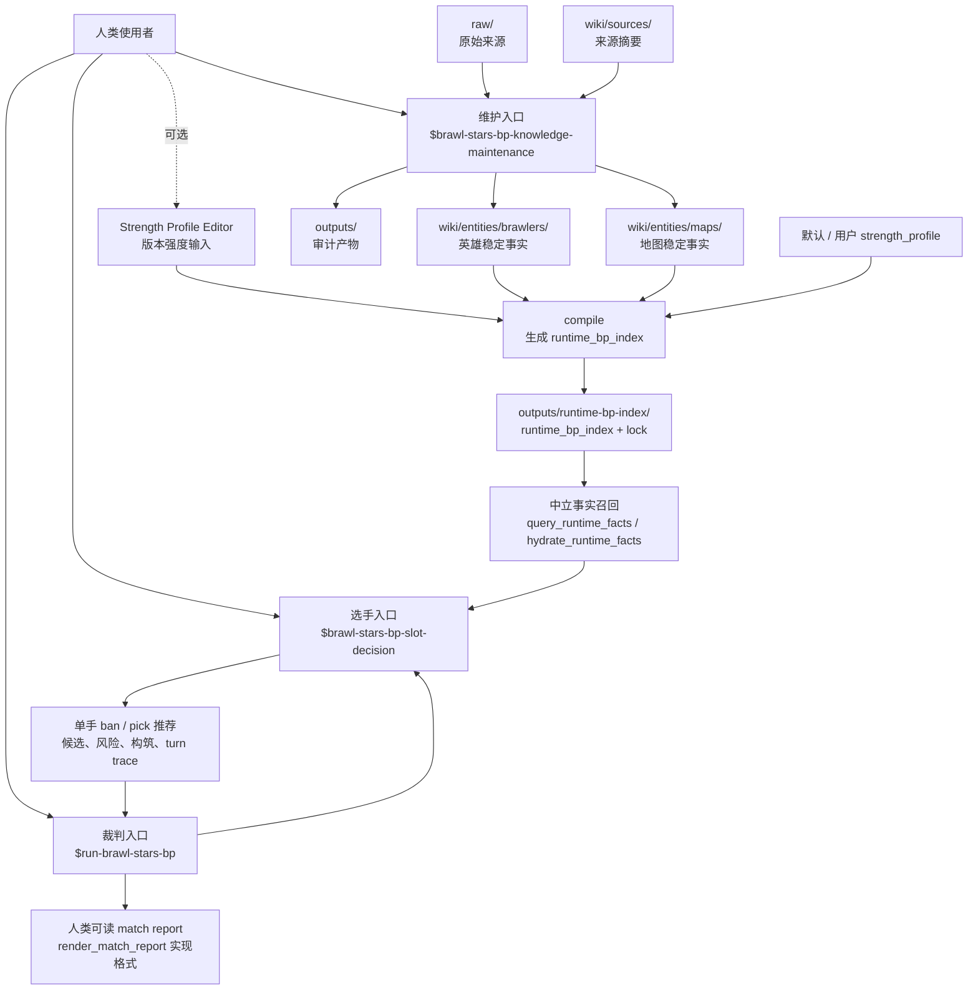

# Think Like a Pro Brawlstar Player

这个仓库维护一套《荒野乱斗》BP 知识库和 3 个 agent skill。目标不是手写一份固定 tier list，而是让 agent 先形成当前版本理解，再像高水平选手一样按地图、模式、已 ban/pick、阵容职责和风险做 BP。

## 为什么要做这套东西

直接把知识库扔给 agent 读，问题是上下文会很快混在一起：来源摘要、维护讨论、稳定事实、临时版本判断都可能被同等使用，最后输出看起来有理，但很难保证它到底依据了什么。这里把流程拆成维护、编译和决策三层：维护层沉淀稳定事实，编译层形成当前版本理解，决策层只拿已经整理好的事实窗口做判断。

直接打开 GPT 问“这局怎么 BP”，问题是它通常依赖泛化记忆和即时推理，缺少本仓库里持续维护的英雄、地图、别名、来源和版本理解，也不容易稳定复现同一套判断边界。这套 skill 把 BP 当成一个有输入、有运行边界、有报告格式的流程：先确定版本理解，再按当前局面做单手决策，完整对局则由裁判 skill 维护隐藏信息和顺序。

## 入口

- `brawl-stars-bp-knowledge-maintenance`：维护知识库。用于补来源、更新英雄 / 地图稳定事实、做 BP profile 审计。
- `brawl-stars-bp-slot-decision`：选手 BP。先 `compile` 生成版本理解，再用 `decide` 做单手 ban / pick 决策。
- `run-brawl-stars-bp`：裁判。负责开局、同步 ban、按顺序 cue 双方选手、汇总人类可读报告。

`tools/strength-profile-editor/` 是 `brawl-stars-bp-slot-decision compile` 的附带工具，用来输入你自己的版本强度理解。事实召回脚本和报告渲染器是 skill 内部实现，不是用户入口。

## 如何使用

### 1. 先生成版本理解

默认版本理解使用稳定 wiki 事实和已采纳的默认强度理解：

```text
使用 $brawl-stars-bp-slot-decision compile 当前版本理解。
```

如果你想输入自己的版本理解，先打开本地编辑器：

```bash
python3 -m http.server 4173
```

然后访问：

```text
http://localhost:4173/tools/strength-profile-editor/
```

导出 JSON 后，把它贴给 `compile`：

```text
使用 $brawl-stars-bp-slot-decision compile，并使用我刚导出的强度理解。
```

### 2. 做单手 BP 决策

```text
使用 $brawl-stars-bp-slot-decision decide 帮我判断这一手怎么选。

当前局面：
- Double Swoosh，Gem Grab
- 我方蓝队，当前是 4-5 两手
- 我方已有 Gene
- 对面已有 Max、Sandy
- 已 ban：Kenji、Moe、Rico、Lily、Angelo、Sprout
- 我想打得主动一点

给我 2-4 个候选组合，说明首选、备选、各自解决什么问题、会暴露什么风险，以及对面最后一手最需要防什么。
```

`decide` 会使用已经编译好的版本理解；如果缺少必要索引，skill 会自行补编译或明确失败，不会凭记忆或临时读维护讨论页补答案。

### 3. 开一局完整 BP

```text
使用 $run-brawl-stars-bp 开一局 Ranked BP 模拟，地图从当前 Ranked 地图池里随机选。
跑完整局后给我报告。
```

如果想固定地图和双方策略参数：

```text
使用 $run-brawl-stars-bp 在 Center Stage 开一局 BP。

蓝方按均衡风格打，红方按进攻风格打。
```

可用风格可以用自然语言描述，例如稳健、均衡、进攻、高波动。没有指定时，裁判 skill 会按默认规则处理。

裁判只负责发牌、隐藏信息、流程和报告，不做独立 BP 评价；所有 ban / pick 理由来自选手侧 `brawl-stars-bp-slot-decision`。

### 4. 维护知识库

```text
使用 $brawl-stars-bp-knowledge-maintenance 更新 Brock 的 BP 资料。
```

```text
使用 $brawl-stars-bp-knowledge-maintenance 更新 Center Stage 的 BP 地图资料。
```

维护 skill 会自己处理来源检查、source summary、实体页更新、审计和日志。日常问答不写 wiki；明确要求维护、ingest、记录或更新时才持久化。

## 架构



## 运行边界

- `compile` 读取稳定英雄 / 地图事实和 strength profile，生成 `runtime_bp_index`。
- `decide` 只通过 `query_runtime_facts.py` 和 `hydrate_runtime_facts.py` 召回中立事实，再由选手 skill 做 BP 判断。
- `decide` 不读取 `wiki/syntheses/` 临时补规则、补强度或补候选。
- strength profile 是版本强度层，只影响当前版本理解；不能反写成英雄或地图稳定事实。
- 裁判不判断谁 BP 更好，不给胜率，不修正选手逻辑，只记录流程和玩家提交内容。
- 生成的 runtime index、审计和模拟报告默认放在 `outputs/`，不写回长期 wiki。

## 测试覆盖

当前覆盖重点：

- slot-decision runtime index、precheck、fact query / hydrate、compile 行为：21 个 unittest。
- strength profile editor：catalog、map-strength profile、前端 profile core。
- maintenance：BP skill contract、PLP matchup coverage audit。

当前本地验证状态：上述测试 100% 通过。
