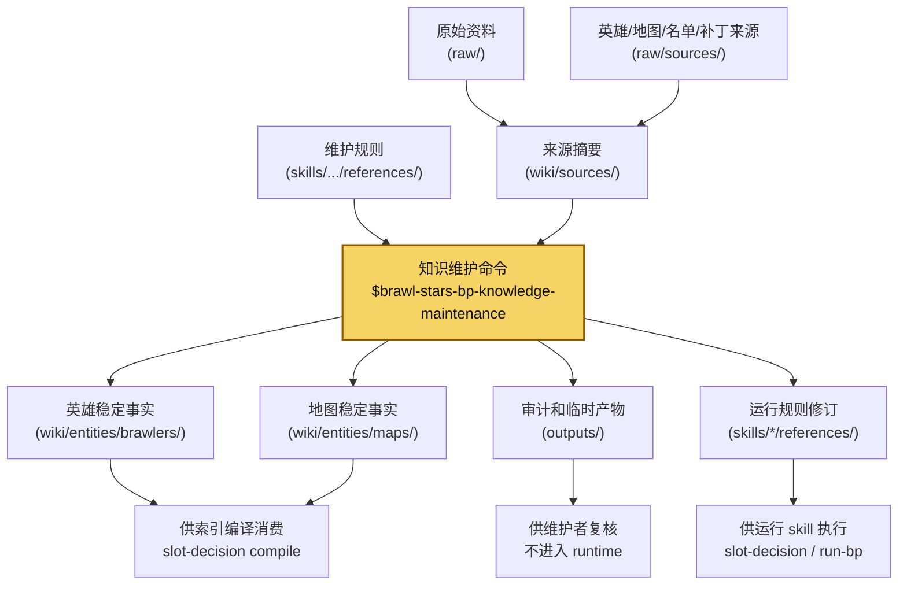
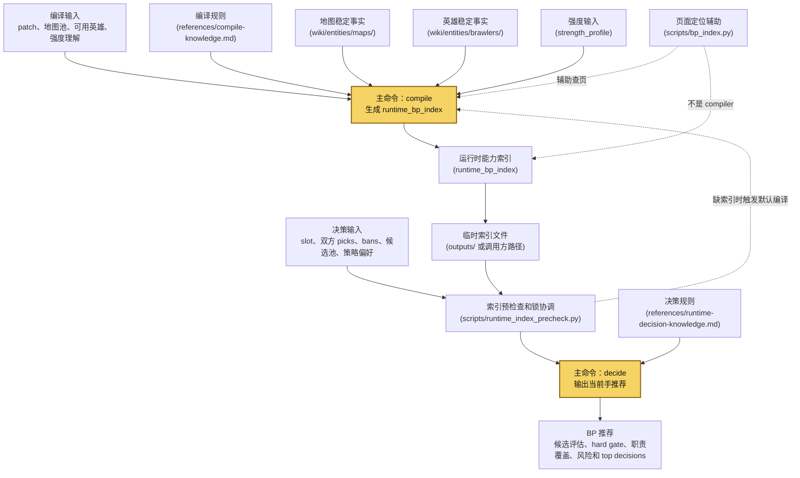
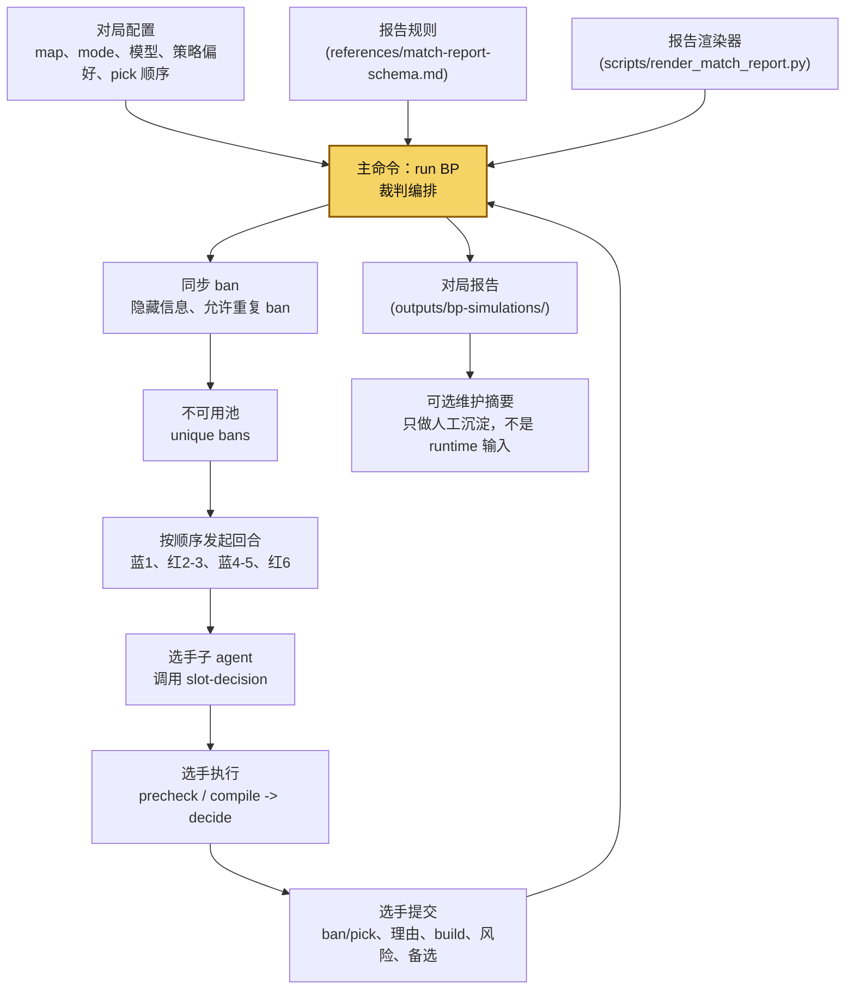

# Brawl Stars BP Agent Prompts

本仓库维护《荒野乱斗》BP 知识库、一套知识维护 skill 与两个运行 skill：

- `brawl-stars-bp-knowledge-maintenance`：维护 skill，负责 source ingest、英雄/地图稳定事实建模、审计和 runtime 边界治理。
- `run-brawl-stars-bp`：裁判 skill，只负责发牌、维护隐藏信息、cue 流程、记录选手提交内容和回合指标。
- `brawl-stars-bp-slot-decision`：选手 BP skill，负责先编译 `runtime_bp_index`，再基于该索引对单个 ban / pick slot 做决策。

## 如何使用

运行侧主要使用两个 skill：`run-brawl-stars-bp` 负责开局和裁判编排，`brawl-stars-bp-slot-decision` 负责单手 ban / pick 决策。

### 使用裁判 skill 开一局 BP

```text
使用 $run-brawl-stars-bp 开一局 Ranked BP 模拟，地图从当前 Ranked 地图池里随机选。

跑完整局后给我报告。
```

如果想固定双方风格，可以这样说：

```text
使用 $run-brawl-stars-bp 在 Center Stage 开一局 BP。

blue_strategy_bias: balanced
red_strategy_bias: aggressive

其他流程按 skill 默认规则执行。
```

### 直接调用 BP skill

```text
使用 $brawl-stars-bp-slot-decision compile 当前版本默认强度索引。

地图池用当前 Ranked 地图池，英雄池用当前 BP-active 英雄集合。
我没有额外强度表；请按当前稳定 wiki 事实做默认版本理解，不要凭记忆补 tier。

产出 runtime_bp_index，后续 decide 都用这个索引。
```

如果要带用户自己的强度理解，可以预留成这样。这个能力还在开发中，当前先作为输入格式占位：

```text
使用 $brawl-stars-bp-slot-decision compile，并使用我提供的强度理解。

strength_profile:
- Spike 在 Gem Grab 里按 A 级处理，理由是当前版本中距控图稳定。
- Max 在开阔图按 A 级处理，但遇到硬控路线时证明门槛提高。
- Jacky 当前版本按低优先级处理，除非地图明确有墙边接触和目标收益。

请把这些只作为 strength layer，不要改写英雄或地图稳定事实。
```

做单手决策时这样调用 `decide`：

```text
使用 $brawl-stars-bp-slot-decision decide 帮我判断这一手怎么选。

当前局面：
- Double Swoosh，Gem Grab
- 我方蓝队，当前是 4-5 两手
- 我方已有 Gene
- 对面已有 Max、Sandy
- 已 ban：Kenji、Moe、Rico、Lily、Angelo、Sprout
- strategy_bias: aggressive
- 我没有额外版本强度表；强度来源先按 unknown 处理

给我 2-4 个候选组合，说明首选、备选、各自解决什么问题、会暴露什么风险，以及对面最后一手最需要防什么。
```

`decide` 会自己先做 runtime index 预检查：已有可用索引就直接用；没有索引就由一个进程上锁并执行默认 `compile`；其他并发 `decide` 只轮询等待，超出重试次数会失败退出，不会一直卡住。

## 拓扑信息

本仓库当前维护三类 BP skill：知识维护、选手决策、裁判编排。三者共享同一套资料层，但运行边界不同：维护 skill 生产稳定英雄/地图事实；选手 skill 把稳定事实编译成运行时索引并做单手决策；裁判 skill 不做 BP 判断，只编排对局并记录选手提交。

### `brawl-stars-bp-knowledge-maintenance`

维护 skill 负责把来源资料整理成稳定 BP 事实。它不直接生产 pick/ban 决策，也不把 BP 维护结果写成概念页或专题页；它的核心产物是给 `compile` 消费的英雄页和地图页。



### `brawl-stars-bp-slot-decision`

选手 skill 有两个主命令：`compile` 生成本局可消费的能力索引，`decide` 用索引和当前 BP 状态输出 ban/pick 推荐。当前 `bp_index.py` 只是定位稳定页面的辅助工具，不是完整 compiler。



### `run-brawl-stars-bp`

裁判 skill 负责读取对局配置、启动选手子 agent、维护隐藏信息和写报告。它不读取英雄/地图页面做自己的 BP 判断；所有 ban/pick 理由都来自选手侧 `brawl-stars-bp-slot-decision`。



## 维护命令示例

维护侧使用 `brawl-stars-bp-knowledge-maintenance`。它适合补抓来源、整理 source summary、升级英雄/地图稳定事实、跑审计和维护 runtime 边界。维护前先读 `AGENTS.md`、`wiki/index.md` 和该 skill 的相关 reference。

### 维护某个英雄的 BP 资料

```text
使用 $brawl-stars-bp-knowledge-maintenance 更新 Brock 的 BP 资料。
```

这就够了。来源检查、source summary、英雄实体页、审计和日志都是 skill 内化流程。只有当你有明确关注点时，再加一句：

```text
使用 $brawl-stars-bp-knowledge-maintenance 更新 Brock 的 BP 资料，重点看构筑和对位信息。
```

### 维护某张地图的 BP 资料

```text
使用 $brawl-stars-bp-knowledge-maintenance 更新 Center Stage 的 BP 地图资料。
```

如果你想指定关注点，可以这样说：

```text
使用 $brawl-stars-bp-knowledge-maintenance 更新 Center Stage 的 BP 地图资料，重点看中场路线和球门入口。
```
