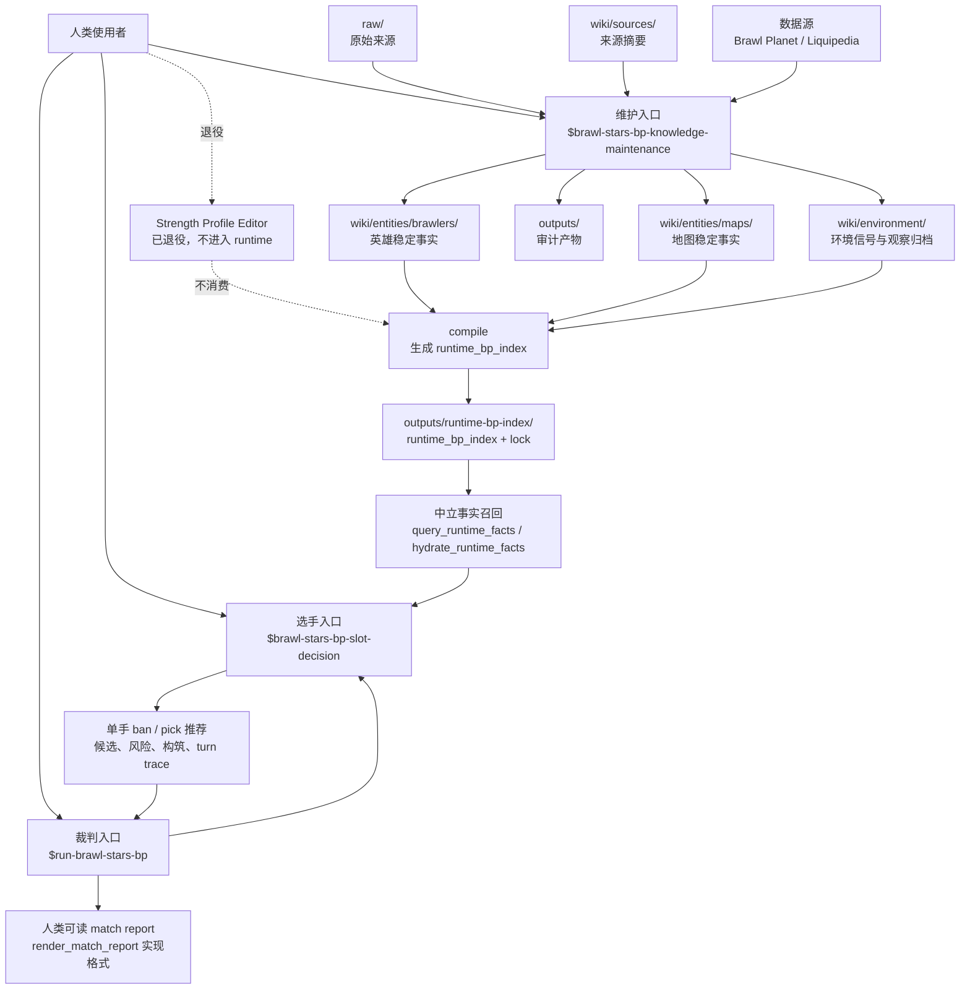

# Think Like a Pro Brawlstar Player

这个仓库维护一套《荒野乱斗》BP 知识库和 3 个 agent skill。目标不是手写任何 tier list 或强度榜，而是让 agent 基于稳定事实（英雄能力、地图职责、条件化对位）像高水平选手一样按地图、模式、已 ban/pick、阵容职责和风险做 BP。环境信号（高分 pick rate）作为三维决策证据由 decide 按需查询，不进 compile。

## 为什么要做这套东西

直接把知识库扔给 agent 读，问题是上下文会很快混在一起：来源摘要、维护讨论、稳定事实、临时版本判断都可能被同等使用，最后输出看起来有理，但很难保证它到底依据了什么。这里把流程拆成维护、编译和决策三层：维护层沉淀稳定事实，编译层形成当前版本理解，决策层只拿已经整理好的事实窗口做判断。

直接打开 GPT 问“这局怎么 BP”，问题是它通常依赖泛化记忆和即时推理，缺少本仓库里持续维护的英雄、地图、别名、来源和版本理解，也不容易稳定复现同一套判断边界。这套 skill 把 BP 当成一个有输入、有运行边界、有报告格式的流程：先确定版本理解，再按当前局面做单手决策，完整对局则由裁判 skill 维护隐藏信息和顺序。

## 核心设计理念

这套体系建立在几条相互支撑的信念上，维护和扩展时不要破坏它们：

### 1. 事实与解释分层，混合函数刻意不明确

知识库只沉淀“事实”，不沉淀“结论”。compile 只产出事实窗口（能力、地图职责、条件化对位、来源引用），BP 解释权全部交给 LLM / 人类思考者。月赛数据、传奇+实战数据、英雄能力建模三者的“混合函数”故意不写成公式——一旦写成 0.3×月赛 + 0.4×传奇 + 0.3×机制，它就会把“思路参考”当“强度锚”、把“强度锚”当“决策指令”，并让历史数据冒充当前版本。不明确，所以不固化，所以不骗人。所有事实都只承担一个语义角色：**供参考，供解释，不替思考者做决定**。

### 2. 决策质量可观测，单局结果不可观测

一局的胜负 = 决策 × 执行 × 运气。100 分的 BP 可能被操作拖输，烂选也可能被精彩操作盘活——**单局结果无法验证决策**。但决策质量本身可以脱离结果被评价：证据找全了吗？先验合理吗？三个维度都查了吗？信心与证据量匹配吗？这套体系只承诺后者：每个决策留下可审查的痕迹（turn trace、证据角色、信心程度），让“这手选得对不对”可以脱离“这局赢没赢”来讨论。

### 3. 证据累积式的信心更新

BP 决策不是套公式，而是：先有一个先验想法 → 分别去月赛 / 传奇+ / 机制成立三个维度找证据 → 证据越多信心越高 → 证据不足时承认这一手对胜负的决定性模糊。三个维度有不同的证据等级：

| 维度 | 角色 | 权重 |
| --- | --- | --- |
| 月赛（Liquipedia） | 顶尖选手思路参考，小样本 | 低，只作提示 |
| 传奇+排位（Brawl Planet） | 强度锚，大样本但 10 周滚动、滞后于补丁 | 高（标注滞后） |
| 机制 / 能力建模 | 可行性约束，稳定事实 | 最高，决定候选能否成立 |

冲突时机制约束优先于强度锚、强度锚优先于月赛提示。信心必须显式报告：三维一致 = 高信心；机制+传奇支持但月赛矛盾 = 中信心并点名冲突；只有机制支撑 = 低信心，标记为理论选；证据不足 = 明确说这手对胜负的影响模糊，不硬凑信心。

### 4. 环境信号是决策证据，不是决策指令

传奇+选取率 / 月赛 ban 率是三维决策框架中的**证据维度**：机制约束（最高权重）决定候选能否成立，传奇+强度锚（高权重、标注 10 周滞后）校准候选池，月赛提示（低权重）提供顶尖思路。维护侧把信号归档在 `wiki/environment/`（持久知识库层），`compile` 是唯一聚合点，把它们折叠进 `runtime_bp_index` 作为**标注过的 per-brawler 证据**（`environment_evidence`：`ladder_anchor` / `monthly_finals`）；decide 通过 `hydrate_runtime_facts.py` 从索引读取，不再直连信号文件。它**永远不能推翻机制约束、不生成 tier、不改变 fit/eligibility**。证据强度随每次数据更新变化，但三维判断框架本身不变。数据是佐证，佐证不替代推理。

### 5. 转录损失不在决策路径上

英雄页对社区来源的拆解是机械、忠实、带溯源的（每个 BP 字段挂 source 引用）。即便个别冷门对位在拆解中被取舍（转录损失），它影响的也只是“知识库完备性”，不影响任何一次 BP 决策的正确性——compile/decide 只消费页面已有的字段，缺一条不会产生错误推荐，只会少一个考虑项。因此转录质量按 wiki 完备性任务治理，不占用决策预算。

## 入口

- `brawl-stars-bp-knowledge-maintenance`：维护知识库。用于补来源、更新英雄 / 地图稳定事实、做 BP profile 审计。
- `brawl-stars-bp-slot-decision`：选手 BP。先 `compile` 生成版本理解，再用 `decide` 做单手 ban / pick 决策。
- `run-brawl-stars-bp`：裁判。负责开局、同步 ban、按顺序 cue 双方选手、汇总人类可读报告。

`tools/strength-profile-editor/` 已从 runtime 消费路径退役（保留代码但不再被 compile 消费）；tier 编辑产物不得进入 runtime。事实召回脚本和报告渲染器是 skill 内部实现，不是用户入口。

## 如何使用

### 1. 先生成运行时索引

默认索引由稳定 wiki 事实 + `wiki/environment/current.json` 指向的环境归档编译（无归档或 `--no-environment` 时环境槽为空，索引只含稳定事实）：

```text
使用 $brawl-stars-bp-slot-decision compile 当前版本理解。
```

旧的 tier 编辑器已退役，不再作为 compile 输入。

```bash
python3 -m http.server 4173
```

然后访问：

```text
http://localhost:4173/tools/strength-profile-editor/
```

（无强度输入路径。）

### 2. 做单手 BP 决策

```text
使用 $brawl-stars-bp-slot-decision decide 帮我判断这一手怎么选。

当前局面：
- Double Swoosh，Gem Grab
- 我方蓝队，当前是 4-5 两手
- 我方已有 Gene
- 对面已有 Max、Sandy
- 已 ban：Kenji、Moe、Rico、Lily、Angelo、Sprout
- 我想打得主动一点

给我 2-4 个候选组合，说明首选、备选、各自解决什么问题、会暴露什么风险，以及对面最后一手最需要防什么。
```

`decide` 会使用已经编译好的运行时索引；如果缺少必要索引，skill 会自行补编译或明确失败，不会凭记忆、旧榜单或临时读维护讨论页补答案。

### 3. 开一局完整 BP

```text
使用 $run-brawl-stars-bp 开一局 Ranked BP 模拟，地图从当前 Ranked 地图池里随机选。
跑完整局后给我报告。
```

如果想固定地图和双方策略参数：

```text
使用 $run-brawl-stars-bp 在 Center Stage 开一局 BP。

蓝方按均衡风格打，红方按进攻风格打。
```

可用风格可以用自然语言描述，例如稳健、均衡、进攻、高波动。没有指定时，裁判 skill 会按默认规则处理。

裁判只负责发牌、隐藏信息、流程和报告，不做独立 BP 评价；所有 ban / pick 理由来自选手侧 `brawl-stars-bp-slot-decision`。

### 4. 维护知识库

```text
使用 $brawl-stars-bp-knowledge-maintenance 更新 Brock 的 BP 资料。
```

```text
使用 $brawl-stars-bp-knowledge-maintenance 更新 Center Stage 的 BP 地图资料。
```

维护 skill 会自己处理来源检查、source summary、实体页更新、审计和日志。日常问答不写 wiki；明确要求维护、ingest、记录或更新时才持久化。

## 架构


```mermaid
flowchart TD
  U["人类使用者"] --> M["维护入口<br/>$brawl-stars-bp-knowledge-maintenance"]
  U --> P["选手入口<br/>$brawl-stars-bp-slot-decision"]
  U --> J["裁判入口<br/>$run-brawl-stars-bp"]
  U -.退役.-> E["Strength Profile Editor<br/>已退役，不进入 runtime"]

  R["raw/<br/>原始来源"] --> M
  S["wiki/sources/<br/>来源摘要"] --> M
  M --> B["wiki/entities/brawlers/<br/>英雄稳定事实"]
  M --> A["wiki/entities/maps/<br/>地图稳定事实"]
  M --> ENV["wiki/environment/<br/>环境信号与观察归档"]
  M --> O["outputs/<br/>审计产物"]

  D["数据源<br/>Brawl Planet / Liquipedia"] --> M
  E -.不消费.-> C["compile<br/>生成 runtime_bp_index"]
  B --> C
  A --> C
  ENV --> C
  C --> I["outputs/runtime-bp-index/<br/>runtime_bp_index + lock"]

  I --> Q["中立事实召回<br/>query_runtime_facts / hydrate_runtime_facts"]
  Q --> P
  P --> X["单手 ban / pick 推荐<br/>候选、风险、构筑、turn trace"]

  J --> P
  X --> J
  J --> H["人类可读 match report<br/>render_match_report 实现格式"]
```

## 运行边界

- `compile` 读取稳定英雄 / 地图事实 + `wiki/environment/current.json` 指向的环境归档，生成 `runtime_bp_index`；环境信号折叠为**标注过的证据**（`environment_evidence`），无 strength/tier 输入。
- `decide` 只通过 `query_runtime_facts.py` 和 `hydrate_runtime_facts.py` 召回中立事实（含索引内嵌环境证据），再由选手 skill 做 BP 判断；不再有独立环境证据工具。
- `decide` 不读取 `wiki/syntheses/` 临时补规则、补强度或补候选。
- 系统中不存在 strength / tier 概念；任何旧榜单或强度档案都不得作为 runtime 输入。
- 裁判不判断谁 BP 更好，不给胜率，不修正选手逻辑，只记录流程和玩家提交内容。
- 生成的 runtime index、审计和模拟报告默认放在 `outputs/`；观察 profile 与环境信号归档在 `wiki/environment/`（持久知识库层）。

## 测试覆盖

当前覆盖重点：

- slot-decision runtime index、precheck、fact query / hydrate、compile 行为：21 个 unittest。
- strength profile editor：已退役（保留代码，不消费）。
- maintenance：BP skill contract、PLP matchup coverage audit。

当前本地验证状态：上述测试 100% 通过。
