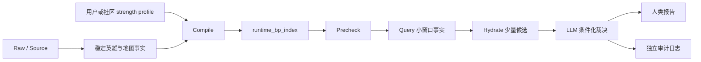

# BP 知识压缩与决策质量演进复盘

状态日期：2026-07-10。性质：`maintenance_retrospective_non_runtime`。

本文复盘这轮 BP 系统从“让 LLM 直接阅读全知识库”走向“稳定事实编译、工具小窗口召回、LLM 条件化裁决”的过程。重点不是罗列代码改动，而是说明：为了提高 BP 质量，我们怎样压缩知识、清洗数据；哪些抽象曾让决策质量明显下降；后来又靠哪些边界把质量拉回到正确方向。

本文是维护者记录，不是 BP runtime 依赖。正式执行规则以 `skills/brawl-stars-bp-slot-decision/` 和 `skills/run-brawl-stars-bp/` 为准。

## 一、最初要解决的问题

知识库已经覆盖 104 个 BP-active 英雄，并为英雄维护了能力、构筑、地图 hook、目标职责、失败条件、条件化对位和 slot 说明；地图侧也维护了路线、位置、目标收益、hard gate 与假阳性过滤。信息量足够，但直接让模型每手 BP 全量阅读存在三个问题：

- 慢：每手都要重新搜索英雄页、地图页和对位信息。
- 贵：大量相同稳定事实被反复送进上下文。
- 不稳定：模型每次读取范围不同，容易漏掉关键能力、失败条件或对位边。

因此我们希望建立一个可再生的中间层：把稳定知识和当前版本强度编译成 `runtime_bp_index`，正式 BP 只按当前地图、slot 和已公开阵容召回少量事实。

真正目标从来不是“生成一张标准答案表”，而是：

1. 加快事实定位。
2. 保留原始能力语义、成立条件和失败条件。
3. 让模型仍然负责当前局面的综合判断。
4. 让每手决策可以审计，而不是只看到结论和事后理由。

> [!important] 最终收敛的三条原则
> 1. 能力模型、地图职责和模式胜利条件是地基；强度不能创造适配性。
> 2. synergy 与 counter 都是当前阵容下可能产生的偏好，不是任何 slot 的硬目标。
> 3. 中间层和工具负责召回事实，不负责替 LLM 产出业务判断或标准答案。

## 二、知识压缩路线

这条路线经历了四次关键整理：

| 阶段 | 做了什么 | 解决的问题 |
| --- | --- | --- |
| 稳定事实建模 | 将 104 个英雄统一整理为可消费的 BP profile，并把地图因素写成路线、位置、目标收益和失效条件。 | 避免只靠粗定位、标签或英雄印象做 BP。 |
| 删除手写索引 | 删除长期维护的对位边索引和地图适配索引，改由 compile 从英雄页、地图页重新生成。 | 消除同一知识多处维护和同步漂移。 |
| 建立强度输入层 | 调研第三方 Tier List Maker，最终自建本地编辑器；用名称归一化表接收中文别称、emoji 和外部榜单。 | 让版本强度成为可编辑、可导入、可导出的独立输入，不污染稳定事实。 |
| 编译与小窗口消费 | 建立 compile、precheck、query、hydrate；工具记录召回片段数和 payload KB。 | JSON 可以变丰富，但模型不必全量阅读。 |

关联背景见 [[syntheses/BP-运行时索引编译架构|BP 运行时索引编译架构]]、[[syntheses/BP-strength-profile-tierlist-maker调研|BP strength_profile tier list maker 调研]] 和 [[sources/iKaoss11-July-2026-Strength-Profile|iKaoss11 July 2026 Strength Profile]]。

## 三、第一次踩坑：把“压缩”做成了“提前算答案”

最早的 compile 产物试图把太多推理结果预先展开。单图原型一度超过一万行，并重复保存英雄卡、地图边、draft 边和各种派生解释。它虽然结构化，却没有真正降低认知负担：人看不完，模型全读也很贵。

这次暴露出一个关键区别：

- 正确的压缩是减少重复、建立索引、保留可恢复语义。
- 错误的压缩是把复杂判断提前折叠成 `fit`、分数或固定候选顺序。

第一轮修正把厚数据移到可选 debug artifact，主产物先收敛为 thin index；随后发现，只要 query / hydrate 工具能严格控制返回窗口，JSON 本体不必追求极薄。于是 runtime v2 又加回了真正有决策价值的信息：全局英雄运行卡、条件化对位边、失败条件、构筑引用和证据引用，但不加回无人消费的宽泛倒排表与重复原始边。

最终形成的原则是：控制 prompt payload，而不是机械控制 JSON 文件大小。

## 四、第二次质量下降：强度兜底污染地图适配

### 症状

全局 S/A 档英雄在不适合的地图上仍被编译成高地图适配。最典型的例子是 Damian：因为全局强度高、又有 Brawl Ball 模式契约，曾在 Backyard Bowl 被标记为 `strong`。这会让一个短手、高开局风险英雄绕过地图能力检查。

### 根因

早期设计把三件不同的事混在了一起：

- 当前版本强不强。
- 能不能完成这个模式的某类职责。
- 在这张具体地图上是否有可靠路线和位置收益。

“缺地图强度就用模式强度，缺模式强度就用全局强度”的 fallback 对强度信息本身看似完整，但一旦 fallback 结果参与 `fit`，就会把全局强势误写成地图适配。

### 修正

- `map_floor_fit` 只由具体地图 hook 或明确命中的地图能力产生。
- `mode_contract_fit` 只表示存在模式职责证据，固定为 `evidence_only`，不代表可选。
- strength 独立保存 tier/rank，不再升级 `fit`、`map_floor_fit` 或 `slot_eligibility`。
- 地图强度必须来自显式地图 profile，不能从全局榜自动推断。
- 缺少地图证据时保留 `unknown` 或弱证据，不再用下层强度补成地图强势。

这一步恢复了最重要的因果方向：先证明英雄能在地图和模式里完成职责，再讨论它当前版本有多强。

## 五、第三次质量下降：分数与固定排序制造“标准答案”

### 症状

加入强度分、职责分、地图分和固定 tie-break 后，同样输入会稳定地产生同样选择；不同轮次甚至出现完全相同的 ban/pick。ban 常常变成“谁地图榜高就 ban 谁”，双方 ban 高度镜像。报告则在选择之后寻找能力理由，看起来可解释，实质是强度排序主导后的事后合理化。

### 根因

把多个本身不精确的定性字段合成一个数，并不会得到更科学的结果。相反，它会：

- 把上游误标放大成稳定排序差距。
- 隐藏不同证据之间不可通约的问题。
- 让随机性只能在相邻同分项之间抖动，不能改变错误的裁决方向。
- 让维护者很难判断最终选择到底由哪个错误字段推动。

`strength_weight=0.4` 和可复现 decision noise 曾作为中间修正：前者让强度影响可调，后者避免同输入永远输出一个名字。但它们只能缓解表现，不能修复“脚本提前决定答案”的架构问题。

### 修正

- 移除 `decision_score` 一类混合总分，不再继续发明新的分数。
- 强度只作为独立证据；默认权重 0.4 是 LLM 的比较语境，不是查询工具的业务参数。
- 查询顺序只用于压缩事实窗口，明确禁止把 retrieval order 当最终排名。
- 工具禁止输出 `candidate_shortlist`、`ability_gate`、`adjudication`、`answers_enemy_picks`、ban 目的或最终推荐。
- LLM 必须显式比较地图职责、阵容需求、对位成立条件、失败方式、构筑要求和强度证据，再给出结论。

这次调整把可审计对象从“最终总分”换成了“证据、比较和裁决过程”。

## 六、第四次质量下降：counter 先消失，随后又被过度硬化

### Counter 消失

当候选投影按地图强度和 top-N 截断时，一些地图基础适配一般、但能在特定敌方阵容下成立的回答选项，在进入 LLM 之前就被删掉了。结果是后手越来越像从地图榜里挑第二强的人，不再回应已经公开的敌方结构。

修正方式是把候选召回拆成不同通道：

- `map_core`：有具体地图证据的正常候选。
- `map_secondary`：次级地图能力候选。
- `counter_response`：只有当前敌方目标激活关系边时才召回的条件候选。

查询工具增加 `relation-target`，可以为当前公开英雄召回相关条件边；但关系边本身只返回机制、成立条件和失效条件，不直接写成“克制”结论。

### Counter 过度硬化

随后又出现了另一种偏移：为了确保后手“有回答”，代码曾强制双 pick 覆盖不同敌方目标，或让某个局部 counter 占据候选席位。这样会选出只回答对面一人的英雄，却忽略自身阵容计划、地图职责和整体暴露。

这类问题在复盘中表现为：

- 用 Alli 局部回答某个英雄，却忽视 Alli 在 Backyard Bowl 的射程、草丛依赖和开阔场地风险。
- 后手只考虑回答 Bea，却没有检查 Piper 是否会被 Ruffs 沙包和另一条对方路线反过来处理。
- 为了覆盖单个目标选出 Mina，却没有证明她在 Heist 的打库职责、手法门槛和对敌方整体的收益。

最终规则不再把 counter 当后手硬目标。后手应同时比较两种自然产生的价值：

1. 补全己方组合，让己方胜利路线更完整。
2. 选择一个能让对方多个角色或核心路线难受的选项。

只有当对位机制在当前地图、距离、路线、资源和阵容下成立时，它才构成偏好；如果候选只回答一个局部点，却明显破坏己方职责或暴露更大缺口，应被拒绝。

## 七、第五次质量下降：粗粒度模式契约掩盖核心能力缺口

在 Bridge Too Far 等 Heist 图的召回中，曾出现 Emz、Buzz、Sandy、Moe 等不合理候选。问题不只是强度排序，而是 `mode_contract_fit` 把“英雄页里提过这个模式”粗略概括成“能完成模式职责”。

Heist 的核心问题不是英雄能否打架，而是阵容能否形成可靠打库、守库、换线或 race 计划。Sandy / Moe 之类候选如果没有足够 safe DPS、远程施压或明确的守转攻机制，就不能因为存在模式文字而进入正常候选层。

修正后：

- 模式契约只是证据存在，不是可用性结论。
- 查询必须先读 `map_fact_packet` 中的 objective、required capabilities、route gates、hard gates 和 false-positive filters。
- 候选如果无法解释如何完成该图的目标职责，要么拒绝，要么明确标记为高证明门槛的例外。
- 任何“能打这个模式”的结论都必须落到具体目标收益，而不是抽象标签。

## 八、Ban 逻辑从“封最强”转向“封最难处理”

早期 ban 直接复用了地图强度顺序，导致 Brock 这类地图强但有大量后手处理方式的英雄频繁上 ban；双方也容易提交相同的三名高强度英雄。问题在于 ban 没有考虑本方后续计划和选边权力。

当前规则把蓝红两侧的 ban 目的分开：

- 蓝方拥有首选权，应保护一个可扩展的首手计划、移除该计划的低成本广谱回答，并保留自己想先拿的灵活英雄。
- 红方拥有最后反制位，应限制蓝方安全且难暴露方向的首手，同时保留自己最后手的反制池。

因此“难处理”比“榜单高”更接近 ban 的真实价值。双方仍可重复 ban，但如果重复，理由应来自双方不同 slot 权力下都认为该英雄难以放行，而不是因为它排在强度榜最前。

## 九、审计方式也经历了重构

只输出报告摘要时，我们看不到一手选择为何发生；把全部字段塞进报告后，人又无法判断哪些因素最重要。因此最终拆成两个产物：

### 人类对局报告

- 用中文概括每手最重要的选择理由。
- 显示双方完整 ban 位。
- 只保留关键因素、主要风险和构筑提示。
- 最终阵容公开后，再按全局职责说明星辉、小工具和装备方向。
- 不把一方隐藏理由传给另一方，也不让裁判额外评价阵容优劣。

### 独立 decision log

- 按回合记录输入的公开状态。
- 记录选手 skill 的查询意图、工具调用、原始入参、原始出参和 payload 大小。
- 先用中文解释召回到了什么，再保留底层字段供复核。
- 对位结论必须展示机制、成立条件和失效条件；“Emz 回答 Meg”不能只写论点，还要说明依靠什么距离带、范围压制、自保资源以及何时不成立。
- 记录 serious alternatives 和拒绝原因，避免只看到赢家。

同时，裁判流程改为每局固定两个 match-scoped player agent。每个选手保留本方整局计划和隐藏推理，只接收对方公开的 ban/pick；裁判只编排流程和整理报告。slot 6 后再独立进行 `final_draft_review`，补齐完整阵容的进攻路线、风险缓解和角色配装，不允许回改已锁定选择。

## 十、最终保留与删除了什么

| 类型 | 保留 | 删除或降级 |
| --- | --- | --- |
| 稳定事实 | 英雄能力、构筑切换、地图 hook、目标职责、失败条件、条件化对位。 | 版本强度覆盖段、临时 meta 对稳定页面的重写。 |
| 强度层 | 显式 profile、地图内 tier/rank、同档左右顺序、来源和 hash。 | 用 global/mode 强度推导地图适配；顶层强度直接创造候选资格。 |
| Runtime index | map context、候选地图证据、运行卡、对位边、failure gates、build refs、evidence refs。 | 重复 raw 边、无人消费的宽泛索引、scope fallback 解释、决策结论。 |
| 查询工具 | precheck、query、hydrate、召回片段数和 payload KB。 | `our_pick`、`enemy_pick`、strategy、strength weight 等业务角色参数；工具侧推荐。 |
| 决策 | LLM 对当前局面做条件化比较，强度作为一层证据。 | 混合总分、固定标准答案、强制 counter 覆盖。 |
| 输出 | 中文人类报告 + 独立完整审计日志。 | 报告中的内部字段堆叠、裁判独立 BP 评价、把隐藏理由暴露给对手。 |

## 十一、为什么质量能够回升

质量回升并不是因为算出了更好的分数，而是因为恢复了正确的信息流：

- 能力与目标职责重新成为候选成立的前提。
- 强度从“决定谁能上桌”退回“同层候选中的版本证据”。
- 对位从静态 counter 标签恢复成带机制、成立条件和失败条件的关系。
- synergy 和 counter 不再互斥，也不再被任何一个硬编码为后手目标。
- 召回工具不再生成判断，LLM 可以围绕当前完整阵容做综合取舍。
- 审计日志能暴露论据缺失、地图幻觉和局部最优，而不是只展示一个看似精确的分数。

换句话说，中间层的价值仍然存在：它显著缩短了检索路径，但不再试图替代 BP 本身。

## 十二、当前仍未完成的验收

> [!warning] 当前状态是方向性恢复，不是质量已经完全验收。

- 目前用户调校的全地图 runtime index 约 3.9 MB，工具返回仍可保持在小窗口，但它超过 `compile-knowledge.md` 中“全地图小于 3 MB”的目标；后续应去重，或基于真实 payload 成本重新校准体积门槛。
- BP 质量仍主要依赖人工复盘，没有一套可靠的自动胜率指标。生成式选出也不适合用不稳定红测逐个锁死；测试应优先固定 schema、数据边界、地图假阳性和确定性召回契约。
- 英雄页中的对位边质量不完全一致。只有来源给出“有利”而没有机制的边，必须在报告中明确证据不足，不能自动升级成可靠回答。
- 构筑说明的质量取决于英雄页是否有足够细的 build switch；`final_draft_review` 不能凭空补全缺失资料。
- 多局随机模拟能发现系统性偏移，但不能证明策略更强。仍需按不同模式抽样，重点审计 ban 目的、首手暴露、双 pick 组合完整性和最后手多目标收益。

## 十三、这轮工作的核心教训

1. 知识压缩首先是信息路由问题，不是评分问题。
2. 结构化字段只有在消费方明确时才有价值；没人消费的字段会变成维护噪声。
3. 定性知识不能因为进入公式就自动变得可量化。
4. 任何 fallback 都必须检查是否改变了语义层级；全局强度不能兜底成地图适配。
5. Counter 必须条件化，但条件化不等于强制选出。
6. 检索排序和决策排序必须严格分开。
7. 可审计不是把所有字段展示出来，而是让人看清“本回合发生了什么、依据是什么、哪些替代方案被为什么拒绝”。
8. 人类报告和机器审计日志服务不同读者，必须分层。
9. 中间层最理想的状态不是替 LLM 思考，而是让 LLM 少找资料、多做真正的局面思考。

## 关联页面

- [[syntheses/Ban-Pick-问题拆分|Ban Pick 问题拆分]]
- [[syntheses/条件化对位模型|条件化对位模型]]
- [[syntheses/BP-地图建模与决策规范|BP 地图建模与决策规范]]
- [[syntheses/BP-运行时索引编译架构|BP 运行时索引编译架构]]
- [[syntheses/BP-strength-profile-tierlist-maker调研|BP strength_profile tier list maker 调研]]
- [[syntheses/BP-模拟样本关键结论汇总|BP 模拟样本关键结论汇总]]
- [[syntheses/BP-维护归档|BP 维护归档]]
- [[sources/iKaoss11-July-2026-Strength-Profile|iKaoss11 July 2026 Strength Profile]]

执行规则入口：

- `skills/brawl-stars-bp-slot-decision/references/compile-knowledge.md`
- `skills/brawl-stars-bp-slot-decision/references/runtime-decision-knowledge.md`
- `skills/run-brawl-stars-bp/SKILL.md`
- `skills/run-brawl-stars-bp/references/match-report-schema.md`
